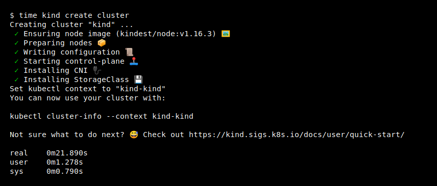

# Sample on how to run NGINX locally with KinD (Kubernetes in Docker)

## 1 - Install docker

[Install Docker](https://hub.docker.com/?overlay=onboarding)

## 2 - Install KinD

[KinD](https://github.com/kubernetes-sigs/kind) is a tool for running local Kubernetes clusters using Docker container “nodes”.
kind was primarily designed for testing Kubernetes itself, but may be used for local development or CI.



On Mac via Homebrew:

```console
brew install kind
```

On Windows:

```powershell
curl.exe -Lo kind-windows-amd64.exe https://kind.sigs.k8s.io/dl/v0.9.0/kind-windows-amd64
Move-Item .\kind-windows-amd64.exe c:\some-dir-in-your-PATH\kind.exe

# OR via Chocolatey (https://chocolatey.org/packages/kind)
choco install kind
```

To use kind, you will need to [install docker].  
Once you have docker running you can create a cluster with:

```console
kind create cluster
```

To delete your cluster use:

```console
kind delete cluster
```

## 3 - Create nginx

```console
kubectl apply -f .\ingress-nginx.yaml
```

## 4 - Create the DemoApp

```console
kubectl apply -f .\demo.yaml
```

## 5 - Run nginx locally

Get the name of the ingress control with the following command e.g.: `ingress-nginx-controller-6967fb79f6-vrbmr`

```console
kubectl get pods -n ingress-nginx
PS C:\ingress-kind-local> kubectl get po -n ingress-nginx
NAME                                        READY   STATUS      RESTARTS   AGE
ingress-nginx-admission-create-sc46m        0/1     Completed   0          5h16m
ingress-nginx-admission-patch-dhfls         0/1     Completed   1          5h16m
ingress-nginx-controller-6967fb79f6-vrbmr   1/1     Running     0          5h16m

```

Then run a port-forward from kubernetes

```console
PS C:\ingress-kind-local> kubectl port-forward ingress-nginx-controller-6967fb79f6-vrbmr -n ingress-nginx 3444:80

```

Navigate to `http://localhost:3444/` or `http://localhost:3444/demo` and check the result.
